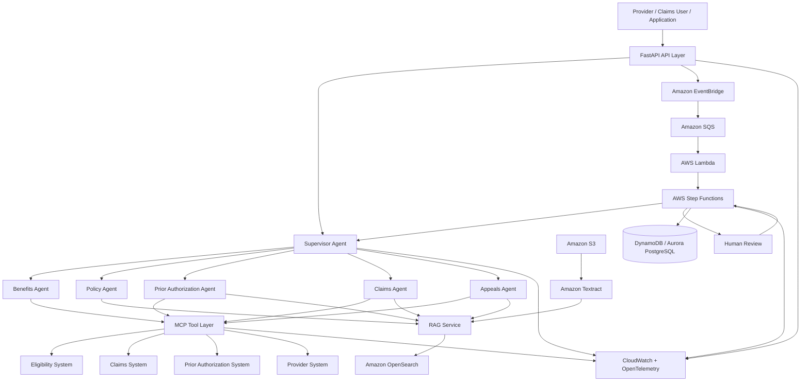

# Agentic Healthcare Insurance Claims & Prior Authorization Platform

An AWS-native agentic AI platform for automating and assisting healthcare insurance workflows including **benefits verification, policy retrieval, prior authorization, claims analysis, and appeals** using OpenAI agents, MCP-based enterprise tools, RAG, deterministic orchestration, and human-in-the-loop controls.


---

## Overview

Healthcare insurance workflows frequently require information to be gathered across policy documents, member benefits, provider systems, claims platforms, authorization systems, and clinical documentation.

This project explores how agentic AI can coordinate those systems while keeping high-impact insurance operations deterministic, auditable, and subject to human review.

The platform is designed around six primary workflows:

1. Benefits and eligibility verification
2. Insurance policy retrieval
3. Prior authorization processing
4. Claims analysis
5. Appeals assistance
6. Human review and escalation

The goal is not to allow an LLM to independently make insurance decisions.

Instead, the architecture combines:

- specialized AI agents
- structured enterprise tools
- RAG
- deterministic workflows
- authorization controls
- human approval
- full observability

---

# Technology Stack

### AI & Agentic Systems

```text
Python
OpenAI Agents SDK
OpenAI Responses API
Amazon Bedrock AgentCore
Model Context Protocol (MCP)
RAG
Structured Outputs
Human-in-the-Loop
```

### Backend

```text
FastAPI
Pydantic
Async Python
REST APIs
Docker
```

### AWS

```text
Amazon S3
Amazon Textract
Amazon OpenSearch
AWS Lambda
AWS Step Functions
Amazon SQS
Amazon EventBridge
Amazon DynamoDB
Amazon Aurora PostgreSQL
Amazon CloudWatch
```

### Observability

```text
OpenTelemetry
Amazon CloudWatch
Distributed Tracing
Agent Tracing
Structured Logging
```

### DevOps

```text
Docker
Terraform
GitHub Actions
CI/CD
```

---

# High-Level Architecture



---

# Agent Architecture

The platform uses a supervisor-and-specialist agent architecture.

## Supervisor Agent

The Supervisor Agent is responsible for understanding the request, maintaining workflow context, selecting the appropriate specialized agent, coordinating multi-agent work, enforcing tool boundaries, and escalating high-impact actions when necessary.

```text
User Request
      ↓
Supervisor Agent
      ↓
Intent Classification
      ↓
┌─────────────────────────────┐
│ Benefits Agent              │
│ Policy Agent                │
│ Prior Authorization Agent   │
│ Claims Agent                │
│ Appeals Agent               │
└─────────────────────────────┘
      ↓
MCP Tools / RAG
      ↓
Structured Result
```

---

# Benefits Verification Agent

Responsible for retrieving insurance benefit information such as:

```text
Member eligibility
Coverage status
Deductibles
Copays
Coinsurance
Benefit limits
Network status
Coverage dates
```

The agent communicates with insurance systems through authorized MCP tools.

---

# Policy Agent

The Policy Agent provides grounded insurance policy retrieval.

Example questions:

```text
Does this procedure require prior authorization?

What are the medical necessity requirements?

Is this procedure covered under the member's plan?

What documentation is required?

What exclusions apply?
```

Responses should reference retrieved policy evidence rather than relying only on the language model's internal knowledge.

---

# Prior Authorization Agent

The Prior Authorization Agent coordinates authorization workflows.

Example workflow:

```text
Provider Request
      ↓
Validate Member
      ↓
Verify Benefits
      ↓
Identify Procedure / Service
      ↓
Retrieve Relevant Policy
      ↓
Determine PA Requirements
      ↓
Check Required Documents
      ↓
Evaluate Completeness
      ↓
Submit / Escalate
      ↓
Track Authorization Status
```

The LLM performs language understanding and reasoning while deterministic workflow logic controls transactional actions.

---

# Claims Analysis Agent

The Claims Agent assists with analyzing:

```text
Claim details
Coverage
Policy rules
Procedure information
Denial codes
Supporting documentation
Authorization status
Potential claim inconsistencies
```

Example workflow:

```text
Claim
  ↓
Member Validation
  ↓
Coverage Verification
  ↓
Policy Retrieval
  ↓
Prior Authorization Verification
  ↓
Claim Data Validation
  ↓
Supporting Document Analysis
  ↓
Agent Analysis
  ↓
Structured Recommendation
  ↓
Human Review when required
```

---

# Appeals Agent

The Appeals Agent assists with generating evidence-backed appeal packages.

Inputs may include:

```text
Claim denial
Denial reason
Insurance policy
Medical documentation
Prior authorization records
Provider documentation
Medical necessity criteria
```

Conceptual output:

```text
Appeal Summary
Evidence
Relevant Policy Sections
Supporting Documents
Identified Discrepancies
Recommended Supporting Information
Draft Appeal Content
```

Final submission can require explicit human approval.

---

# Model Context Protocol

MCP provides a standardized interface between AI agents and enterprise systems.

Conceptually:

```text
AI Agent
   ↓
MCP Client
   ↓
MCP Server
   ↓
Enterprise API / Database
```

Planned MCP servers include:

```text
Eligibility MCP Server
Claims MCP Server
Prior Authorization MCP Server
Provider MCP Server
Policy MCP Server
```

This prevents agents from requiring direct implementation knowledge of every backend system.

---

# RAG Architecture

Insurance policies and healthcare documents can be large, complex, and frequently updated.

RAG is used to ground agent responses in retrieved evidence.

```text
Insurance Documents
        ↓
Amazon S3
        ↓
Amazon Textract
        ↓
Document Normalization
        ↓
Metadata Extraction
        ↓
Chunking
        ↓
Embeddings
        ↓
Amazon OpenSearch
        ↓
Semantic Retrieval
        ↓
Reranking
        ↓
Relevant Policy Evidence
        ↓
Agent
```

Metadata may include:

```text
Plan
Payer
Policy identifier
Policy version
Effective date
Expiration date
Procedure
Specialty
Document section
Page
Source
```

---

# Document Processing

Amazon Textract is used for extracting information from documents such as:

```text
Insurance policies
Prior authorization forms
Explanation of Benefits documents
Claims documents
Provider records
Supporting medical documentation
```

Processing is designed to occur asynchronously.

```text
S3 Upload
    ↓
EventBridge
    ↓
SQS
    ↓
Lambda
    ↓
Textract
    ↓
Normalization
    ↓
Chunking
    ↓
Embedding
    ↓
OpenSearch
```

---

# Event-Driven Architecture

Long-running insurance workflows should not depend on a single synchronous HTTP request.

The architecture therefore uses:

```text
Amazon EventBridge
Amazon SQS
AWS Lambda
AWS Step Functions
```

Example:

```text
FastAPI
   ↓
EventBridge
   ↓
SQS
   ↓
Lambda
   ↓
Step Functions
   ↓
Agent / MCP / RAG
   ↓
Human Review
   ↓
Workflow Completion
```

---

# Why Step Functions?

Agentic reasoning and business workflow orchestration solve different problems.

Agents are useful for:

```text
Understanding unstructured requests
Reasoning across retrieved evidence
Selecting tools
Summarizing documents
Generating structured recommendations
```

Step Functions are useful for:

```text
Retries
Timeouts
Branching
Workflow state
Long-running operations
Human approval
Auditability
Failure handling
Deterministic execution
```

The architecture intentionally combines both.

---

# Human-in-the-Loop

Sensitive operations can require explicit human authorization.

Possible escalation scenarios include:

```text
Low-confidence policy interpretation
Missing clinical evidence
Conflicting insurance information
Claim denial recommendation
Prior authorization exceptions
Appeal submission
Agent uncertainty
Sensitive tool actions
```

Example:

```text
Agent
  ↓
Confidence / Policy Check
  ↓
Human Review Required?
  ↓              ↓
 Yes             No
  ↓               ↓
Review Queue    Continue Workflow
  ↓
Approve / Reject
  ↓
Resume Workflow
```

---

# Guardrails

The platform is designed to incorporate multiple AI safety and enterprise security controls.

```text
Prompt-injection detection
PII / PHI protection
Structured outputs
Tool access controls
Least-privilege IAM
Input validation
Output validation
Agent action validation
Sensitive-operation approval
Audit logging
```

Agents do not receive unrestricted access to enterprise systems.

Tools define the operations an agent is authorized to execute.

---

# Observability

Observability is planned across the application, workflow, infrastructure, and AI layers.

Technologies:

```text
OpenTelemetry
Amazon CloudWatch
Structured logging
Distributed tracing
Agent traces
Workflow metrics
```

Example AI metrics:

```text
Agent execution latency
LLM latency
Token usage
Tool-call count
Tool success rate
Retrieval latency
Retrieval relevance
Agent-routing accuracy
Groundedness
Citation accuracy
Human escalation rate
Workflow completion rate
```

---

# Data Storage Strategy

Different workloads require different storage systems.

### Amazon S3

Used for:

```text
Raw documents
Processed documents
Policy PDFs
Claim attachments
Prior authorization documents
Evaluation datasets
```

### Amazon OpenSearch

Used for:

```text
Vector retrieval
Semantic policy search
Document retrieval
RAG
```

### DynamoDB

Suitable for:

```text
Workflow state
Agent sessions
Idempotency records
Job metadata
Fast key-value access
```

### Aurora PostgreSQL

Suitable for relational domain information such as:

```text
Claims
Members
Providers
Prior authorizations
Workflow audit records
Business entities
```

---

# OpenAI Agent Layer

The project is designed to explore:

```text
OpenAI Agents SDK
OpenAI Responses API
Tool calling
Structured outputs
Multi-agent orchestration
Agent handoffs
Tracing
MCP tools
```

An abstraction layer separates agent business logic from infrastructure so that runtime implementations can evolve independently.

---

# Amazon Bedrock AgentCore

Amazon Bedrock AgentCore is represented in the architecture as an AWS-native runtime/infrastructure option for running and integrating enterprise agent workloads.

The project separates:

```text
Agent business logic
Agent runtime
Enterprise tools
Workflow orchestration
Data services
Observability
```

This allows runtime components to evolve without rewriting the insurance domain logic.

---

# Example End-to-End Prior Authorization Flow

```text
Provider submits request
        ↓
FastAPI
        ↓
Request validation
        ↓
Step Functions workflow
        ↓
Supervisor Agent
        ↓
Eligibility MCP Tool
        ↓
Benefits Agent
        ↓
Policy Agent
        ↓
OpenSearch RAG
        ↓
Prior Authorization Agent
        ↓
Clinical document validation
        ↓
Missing information?
      /        \
    Yes        No
     ↓          ↓
Human /      Continue
Provider      Workflow
Review
     \          /
        ↓
Prior Authorization MCP Tool
        ↓
Submit Request
        ↓
Store Workflow State
        ↓
Audit + Telemetry
```

---

# Repository Structure

A detailed repository architecture is available in:

```text
PROJECT_STRUCTURE.md
```

Primary modules:

```text
app/
├── agents/
├── agent_runtime/
├── api/
├── mcp/
├── rag/
├── workflows/
├── tools/
├── services/
├── document_processing/
├── guardrails/
├── human_review/
└── observability/

infrastructure/
└── terraform/

lambdas/

state_machines/

evaluations/

tests/

docs/
```

---

# Development Roadmap

### Phase 1 — Foundation

- [ ] Repository scaffold
- [ ] FastAPI application
- [ ] Pydantic domain models
- [ ] Configuration management
- [ ] Structured logging
- [ ] Docker environment

### Phase 2 — Synthetic Insurance Domain

- [ ] Synthetic member dataset
- [ ] Synthetic claims
- [ ] Synthetic insurance policies
- [ ] Synthetic prior authorization requests
- [ ] Provider dataset

### Phase 3 — RAG

- [ ] S3 document ingestion
- [ ] Textract integration
- [ ] Document normalization
- [ ] Chunking
- [ ] Embeddings
- [ ] OpenSearch indexing
- [ ] Semantic retrieval
- [ ] Citations

### Phase 4 — Agentic AI

- [ ] OpenAI Agents SDK
- [ ] Responses API
- [ ] Supervisor Agent
- [ ] Benefits Agent
- [ ] Policy Agent
- [ ] Prior Authorization Agent
- [ ] Claims Agent
- [ ] Appeals Agent

### Phase 5 — MCP

- [ ] MCP client
- [ ] Eligibility MCP server
- [ ] Claims MCP server
- [ ] Prior Authorization MCP server
- [ ] Provider MCP server
- [ ] Policy MCP server

### Phase 6 — AWS Workflows

- [ ] Lambda
- [ ] SQS
- [ ] EventBridge
- [ ] Step Functions
- [ ] DynamoDB workflow state
- [ ] Aurora integration

### Phase 7 — Human-in-the-Loop

- [ ] Review queues
- [ ] Approval workflow
- [ ] Escalation logic
- [ ] Audit trail

### Phase 8 — AI Evaluation

- [ ] Retrieval evaluation
- [ ] Tool-call evaluation
- [ ] Agent-routing evaluation
- [ ] Groundedness
- [ ] Citation validation
- [ ] Safety evaluation
- [ ] Regression test suite

### Phase 9 — Production Engineering

- [ ] OpenTelemetry
- [ ] CloudWatch dashboards
- [ ] Terraform
- [ ] GitHub Actions
- [ ] Security testing
- [ ] Load testing
- [ ] Deployment automation

---

# Testing Strategy

The project separates testing into:

```text
Unit Tests
Integration Tests
End-to-End Tests
Agent Evaluations
RAG Evaluations
Security Tests
Workflow Tests
```

Example production failures can later be converted into regression tests.

---

# Healthcare Data Disclaimer

This project is intended as a software engineering and AI architecture demonstration.

Only synthetic or appropriately de-identified data should be included in this public repository.

Do not commit:

```text
Real patient data
Protected Health Information
Production insurance records
API credentials
AWS credentials
Private payer documents
Private provider data
```

---

# Design Principles

The architecture follows several core principles:

**Agents reason; workflows control execution.**

**MCP tools provide controlled access to enterprise systems.**

**RAG grounds policy-related answers in source documents.**

**High-impact actions require deterministic validation or human authorization.**

**Every important agent, tool, and workflow action should be observable and auditable.**

**Production failures should become future evaluation and regression cases.**

---

# Future Extensions

Potential future capabilities include:

```text
FHIR integration
X12 270/271 eligibility workflows
X12 278 prior authorization workflows
X12 837 claims ingestion
X12 835 remittance processing
CMS policy ingestion
Medical coding assistance
Provider portal integration
Voice-based insurance agents
Multi-payer policy comparison
Automated evaluation dashboards
Agent cost and latency optimization
```

---

# Project Goal

The long-term goal is to demonstrate how modern AI engineering techniques can be combined into a realistic healthcare insurance system involving:

```text
Agentic AI
OpenAI Agents SDK
MCP
RAG
AWS
Event-driven architecture
Microservices
Deterministic workflows
Human-in-the-loop AI
Observability
Evaluation
Security
Infrastructure as Code
CI/CD
```

The emphasis is not simply on building a chatbot, but on engineering a **production-oriented agentic system that safely coordinates AI reasoning with real enterprise workflows**.